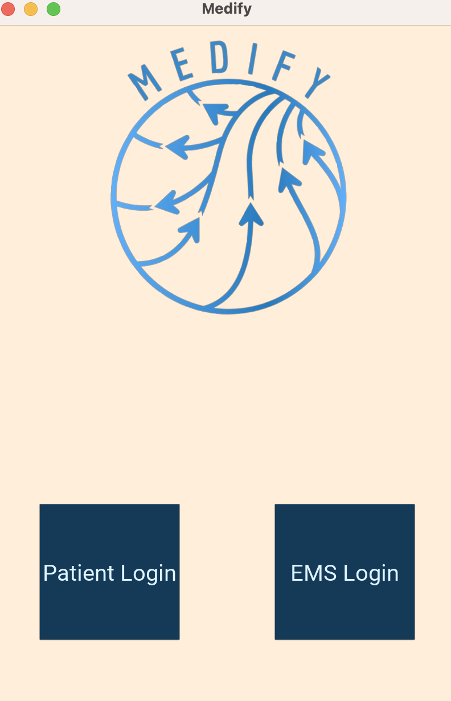
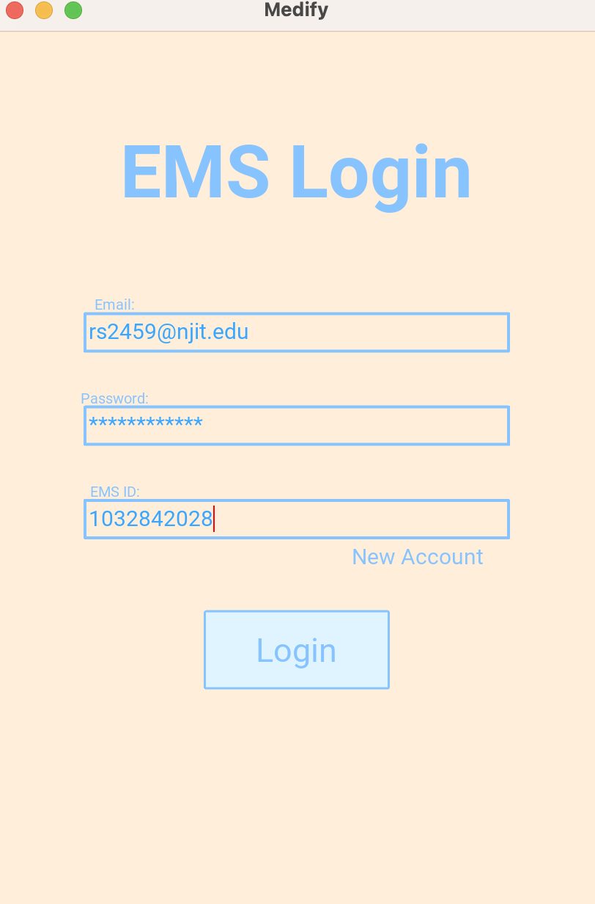
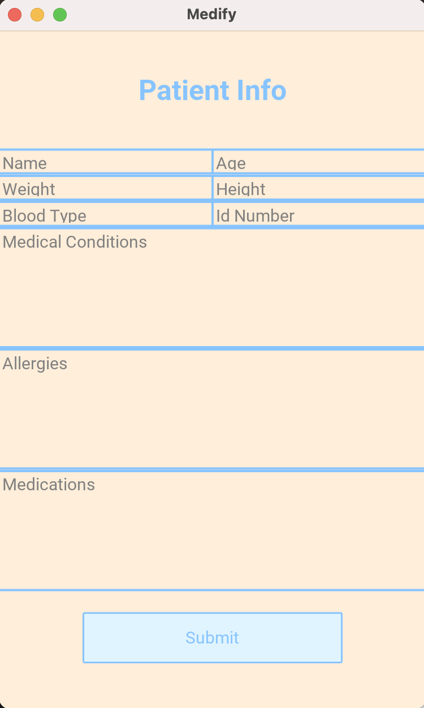

# Medify - HackNJIT2023

> Made by [@rshah713](https://github.com/rshah713), [bdorf04](https://github.com/bdorf04), [@BurhanNaveed0](https://github.com/BurhanNaveed0), and [@jonastirona](https://github.com/jonastirona)
-------
  

-------
A cross-platform mobile application to address the Patient Safety Technology Challenge. Medify features a dual-interface app for both EMT/EMS First Responders along with regular patients. Patients are asked to enter their medical information into the encrypted application. When arriving upon the scene, EMS can verify their status using the [National EMS Registry](https://www.nremt.org/verify-credentials) and access necessary medical information to make more accurate and timely decisions, ultimately saving lives. 

EMS arriving upon scene can use the Drivers ID found on the person to locate all medical information through the EMS facet of the app, once creating an account with the app and proving their EMS status. 

### Technologies
- Frontend built in Python with [kivy](https://github.com/kivy/kivy)
- Backend with [Firebase REST API](https://firebase.google.com) and [Pyrebase](https://github.com/thisbejim/Pyrebase) wrapper
- Authenticated with [Firebase Authentication](https://firebase.google.com/docs/auth)

### Usage
1. Clone the repository
2. Install Dependencies
    - [install kivy](https://kivy.org/doc/stable/gettingstarted/installation.html)
      - `pip3 install kivy`
    - install pyrebase
      - `pip3 install pyrebase4`
    - To run the app from the Python interpreter:
    -   ```bash
        python3 main.py
        ```
3. Create a patient account with a Driver License number
4. Login to the Patient Portal and enter any medical info
5. Create an EMS account (sample EMS ID code `101010` can be used)
6. Login to the EMS portal and enter the Driver License number previously used
7. Boom! Medical Info autofills


### Categories
- Best First-Year Hack
  - 100% Freshman Team
- Best Nautical Hack
  - Medify features a blue color theme palette along with a Nautical theme
- Best Use of Google Cloud
  - Medify relies on Google's Firebase Realtime Database for storage of data
  - Medify encrypts all data and connections through Firebase Authentication
- Most Creative Use of GitHub
  - Open-sourced project features multitude of commits to ensure best practice
  - Secondary repository hosting backend can be found [here](https://github.com/BurhanNaveed0/MedifyBackend)
- Patient Safety Technology Challenge
  - Entirety of Medify aims to reduce EMS/EMT decision error by giving necessary information securely
